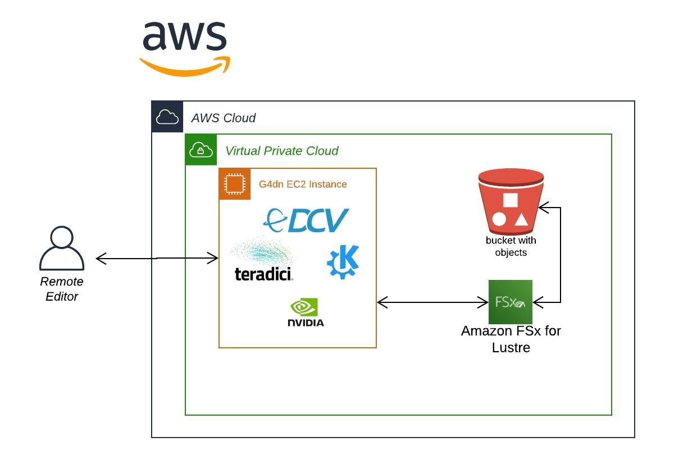

Media Editing with Linux
========================

This repository contains CloudFormation templates and automation to
manage deployment of a Cloud Editing environment.

**Caveat** Explore, build and deploy this as a *sandbox* operating
environment only. It is not recommended to run this in production
without extensive testing.

**Architecture**

**Pre-requisites**

**AWS CLI Profile**

The scripts used below expects a profile. You can create a profile by
following [<u>this
guide</u>](https://docs.aws.amazon.com/cli/latest/userguide/cli-configure-profiles.html)

**Key Pair**

[<u>Create a Key
Pair</u>](https://docs.aws.amazon.com/AWSEC2/latest/UserGuide/ec2-key-pairs.html#having-ec2-create-your-key-pair) in
the region you plan on building this cloud editing environment.

**Usage**

**Purpose**

This is essentially to build and deploy a self-contained Cloud Editing
environment. This will create:

-   A stand-alone VPC across 1 AZs

-   A single edit host (G4 series) with Teradici installed and NVIDIA
    Grid drivers configured

-   A FSx for Lustre filesystem for use in the edit host

**Implementation**

-   Download DeployFSxLustre.json, and use AWS Cloud​Formation

**Connect to Edit Host**

1.  Connect using the Teradici client

2.  Enter the Username and Password created at time of deployment

**Contributors**

-   Avi Drabkin

-   Kim Wendt

-   Zach Willner

-   Kon Wilms

-   Matt Herson (mhersonaws@)

**License**

This library is licensed under the MIT-0 License. See the [<u>LICENSE
file</u>](https://github.com/aws-samples/aws-cloud-video-editing/blob/master/LICENSE.md) .
